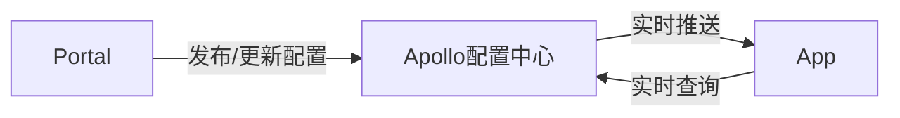
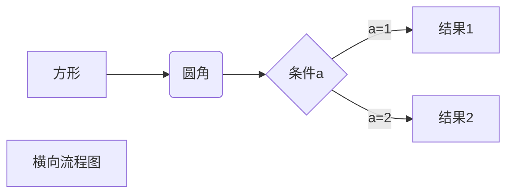
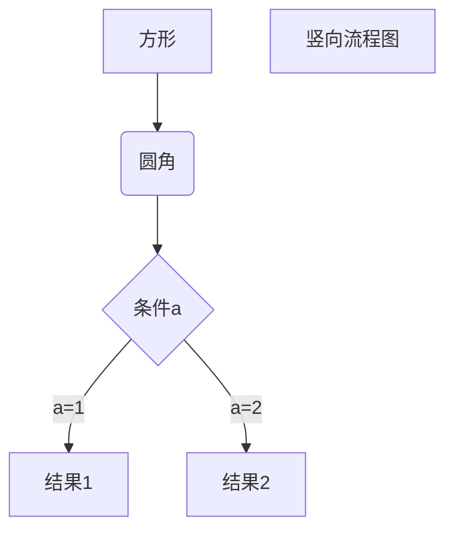
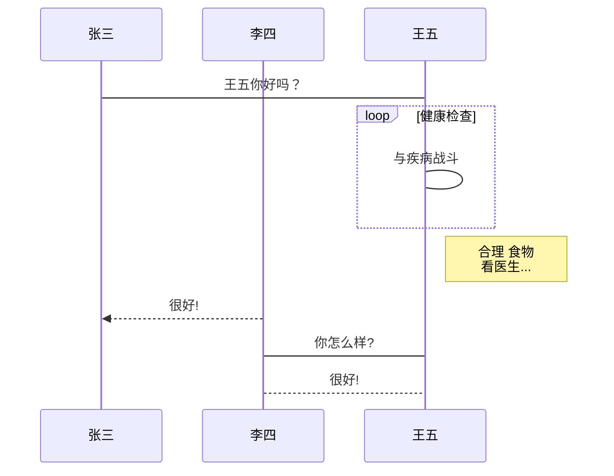
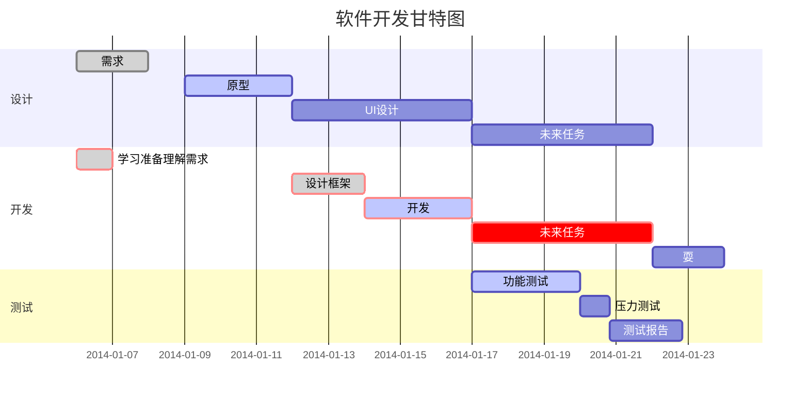
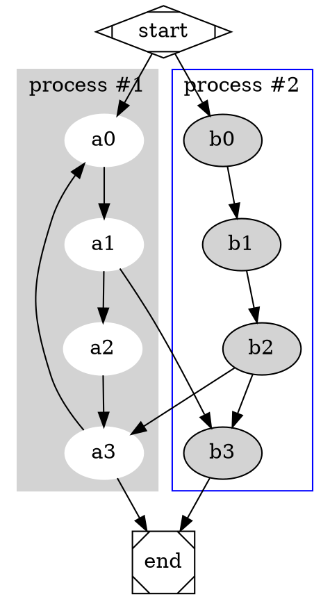
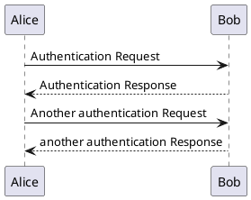

@author yanzhaohu
> 本章节旨在让您掌握Markdown语法，以及扩展的公式，流程图，语法高亮等处理

Markdown 是一种轻量级标记语言，它允许人们使用易读易写的纯文本格式编写文档。

## 1、语法使用
### 1.1、标题
Markdown 标题有两种格式。

第一、用#标识符表示，例如：
>使用 # 号可表示 1-6 级标题，一级标题对应一个 # 号，二级标题对应两个 # 号，以此类推。

```
    # 1级
    ## 2级
    ### 3级
```
效果如下：

# 1级
## 2级
### 3级


第二、使用=和-显示级别
```
我展示的是一级标题
=================

我展示的是二级标题
-----------------
```
效果如下：

我展示的是一级标题
=================

我展示的是二级标题
-----------------
### 1.2、段落和换行

Markdown 段落没有特殊的格式，直接编写文字就好，段落的换行是使用两个以上空格加上回车。

当然也可以在段落后面使用一个空行来表示重新开始一个段落。

### 1.3、字体
Markdown 可以使用以下几种字体：
```
*斜体文本*
_斜体文本_
**粗体文本**
__粗体文本__
***粗斜体文本***
___粗斜体文本___
```
效果：

*斜体文本*
_斜体文本_
**粗体文本**
__粗体文本__
***粗斜体文本***
___粗斜体文本___

### 1.4、分隔线
你可以在一行中用三个以上的星号、减号、底线来建立一个分隔线，行内不能有其他东西。你也可以在星号或是减号中间插入空格。下面每种写法都可以建立分隔线：

```
***

* * *

*****

- - -

----------
```

效果如下：

***

* * *

*****

- - -

----------

### 1.5、删除线
如果段落上的文字要添加删除线，只需要在文字的两端加上两个波浪线 ~~ 即可，实例如下：

```
~~测试~~
```
~~测试~~

### 1.6、下划线
下划线可以通过 HTML 的 `<u>` 标签来实现：
```html
<u>带下划线文本</u>
```     

<u>效果</u>


### 1.7、列表

Markdown 支持有序列表和无序列表。

#### 1.7.1、无序列表使用

使用星号(`*`)、加号(`+`)或是减号(`-`)作为列表标记，这些标记后面要添加一个空格，然后再填写内容：

```
* 第一项
* 第二项
* 第三项

+ 第一项
+ 第二项
+ 第三项


- 第一项
- 第二项
- 第三项
```

效果如下：

* 第一项
* 第二项
* 第三项

+ 第一项
+ 第二项
+ 第三项


- 第一项
- 第二项
- 第三项


#### 1.7.2、有序列表使用

使用数字并加上 . 号来表示，如：
```
1. 第一项
2. 第二项
3. 第三项
```
效果如下：

1. 第一项
2. 第二项
3. 第三项

#### 1.7.3、列表嵌套

列表嵌套只需在子列表中的选项前面添加四个空格即可：

如：
```
1. 第一项：
    - 第一项嵌套的第一个元素
    - 第一项嵌套的第二个元素
2. 第二项：
    - 第二项嵌套的第一个元素
    - 第二项嵌套的第二个元素
```
效果图如下：

1. 第一项：
    - 第一项嵌套的第一个元素
    - 第一项嵌套的第二个元素
2. 第二项：
    - 第二项嵌套的第一个元素
    - 第二项嵌套的第二个元素

### 1.8、区块

Markdown 区块引用是在段落开头使用 > 符号 ，然后后面紧跟一个空格符号：

```
> 区块引用
> Markdown 区块
```

效果如下：
> 说明： 每一行结束需要添加换行标记两个空格才会由如下效果，最后一行不需要

> 区块引用  
> Markdown 区块

另外区块是可以嵌套的，一个 > 符号是最外层，两个 > 符号是第一层嵌套，以此类推：

```
> 最外层
>> 第一层嵌套
>>> 第二层嵌套
```
效果：

> 最外层
>> 第一层嵌套
>>> 第二层嵌套

区块中使用列表
区块中使用列表实例如下：
```
> 区块中使用列表
> 1. 第一项
> 2. 第二项
> + 第一项
> + 第二项
> + 第三项
```
效果：

> 区块中使用列表    
> 1. 第一项    
> 2. 第二项
> + 第一项
> + 第二项
> + 第三项

列表中使用区块

如果要在列表项目内放进区块，那么就需要在 > 前添加四个空格的缩进。

```
* 第一项
    > 区块1
    > 区块2
* 第二项
```

效果：

* 第一项
    > 区块1   
    > 区块2
* 第二项

### 1.9、代码

如果是段落上的一个函数或片段的代码可以用反引号把它包起来（`），例如：
```
`function()` 函数
```
效果：    
`function()` 函数

如果是显示一个整段的代码可以用4 个空格或者一个制表符（Tab 键）或者使用
你也可以用```包裹一段代码，并指定一种语言（也可以不指定）,指定语言可以显示并语法高亮

例如:
```
	```javascript
	$(document).ready(function () {
    	alert('RUNOOB');
	});
	```
```

效果：

```javascript
$(document).ready(function () {
    alert('代码块');
});
```

### 1.10、链接

链接使用方法如下：

```
[链接名称](链接地址)

或者

<链接地址>
```
例如：

```
这是一个链接 [百度](https://www.baidu.com)
```

效果：

这是一个链接 [百度](https://www.baidu.com)

直接使用链接地址：
```
<https://www.baidu.com>
```
效果：

<https://www.baidu.com>

**高级链接**

我们可以通过变量来设置一个链接，变量赋值在文档末尾进行：
```
这个链接用 1 作为网址变量 [Google][1]
这个链接用 baidu 作为网址变量 [百度][baidu]
然后在文档的结尾为变量赋值（网址）

  [1]: http://www.google.com
  [runoob]: http://www.baidu.com
```

效果：

这个链接用 1 作为网址变量 [Google][1]  
这个链接用 baidu 作为网址变量 [百度][baidu]  
然后在文档的结尾为变量赋值（网址）  

  [1]: http://www.google.com
  [baidu]: http://www.baidu.com


### 1.11、图片

Markdown 图片语法格式如下：  
开头一个感叹号 !   
接着一个方括号，里面放上图片的替代文字   
接着一个普通括号，里面放上图片的网址，最后还可以用引号包住并加上选择性的 'title' 属性的文字  
当然，你也可以像网址那样对图片网址使用变量:

```


这个链接用 1 作为网址变量 [RUNOOB][img1].
[img1]: ./test.png

```

> Markdown 还没有办法指定图片的高度与宽度，如果你需要的话，你可以使用普通的 `` 标签。

### 1.12、表格

Markdown 制作表格使用 `|` 来分隔不同的单元格，使用 `-` 来分隔表头和其他行。

语法格式如下：
```
|  表头   | 表头  |
|  ----  | ----  |
| 单元格  | 单元格 |
| 单元格  | 单元格 |
```
效果如下：

|  表头   | 表头  |
|  ----  | ----  |
| 单元格  | 单元格 |
| 单元格  | 单元格 |

**对齐方式**

> 当前文档不支持

我们可以设置表格的对齐方式：

-: 设置内容和标题栏居右对齐。  
:- 设置内容和标题栏居左对齐。  
:-: 设置内容和标题栏居中对齐。

实例如下：

```
| 左对齐 | 右对齐 | 居中对齐 |
| :-----| ----: | :----: |
| 单元格 | 单元格 | 单元格 |
| 单元格 | 单元格 | 单元格 |
```

效果：

| 左对齐 | 右对齐 | 居中对齐 |
| :-----| ----: | :----: |
| 单元格 | 单元格 | 单元格 |
| 单元格 | 单元格 | 单元格 |

## 2、计算公式
使用如下：

公式：使用代码包裹，后面跟上tex  
详情见[Latex公式](https://zhuanlan.zhihu.com/p/110756681)
或则[Latex公式](https://blog.csdn.net/u014630987/article/details/70156489) 
```
	```tex
    	E=mc^2
	```
```
效果：
```tex
E=mc^2
```

## 3、流程图

### 3.1、mermaid 流程图 [mermaid](https://mermaid-js.github.io/mermaid/#/)  
代码：
```
	```mermaid
	graph LR;
	　　Portal-->|发布/更新配置|Apollo配置中心;
	　　Apollo配置中心-->|实时推送|App;
	　　App-->|实时查询|Apollo配置中心;
	```
```
效果：

mermaid实现效果：
#### 3.1.1、横向流程图源码格式
```
	```mermaid
	graph LR
	A[方形] -->B(圆角)
		B --> C{条件a}
		C -->|a=1| D[结果1]
		C -->|a=2| E[结果2]
		F[横向流程图]
	```
```
效果：

#### 3.1.2、竖向流程图源码格式
```
	```mermaid
	graph TD
	A[方形] --> B(圆角)
		B --> C{条件a}
		C --> |a=1| D[结果1]
		C --> |a=2| E[结果2]
		F[竖向流程图]
	```
```
效果：

### 3.1.3、UML标准时序图样例
```
	```mermaid
	%% 时序图例子,-> 直线，-->虚线，->>实线箭头
	sequenceDiagram
		participant 张三
		participant 李四
		张三->王五: 王五你好吗？
		loop 健康检查
			王五->王五: 与疾病战斗
		end
		Note right of 王五: 合理 食物 <br/>看医生...
		李四-->>张三: 很好!
		王五->李四: 你怎么样?
		李四-->王五: 很好!
	```
```
效果：

### 3.1.4、甘特图样例：

```
	```mermaid
	gantt
			dateFormat  YYYY-MM-DD
			title 软件开发甘特图
			section 设计
			需求                      :done,    des1, 2014-01-06,2014-01-08
			原型                      :active,  des2, 2014-01-09, 3d
			UI设计                     :         des3, after des2, 5d
		未来任务                     :         des4, after des3, 5d
			section 开发
			学习准备理解需求                      :crit, done, 2014-01-06,24h
			设计框架                             :crit, done, after des2, 2d
			开发                                 :crit, active, 3d
			未来任务                              :crit, 5d
			耍                                   :2d
			section 测试
			功能测试                              :active, a1, after des3, 3d
			压力测试                               :after a1  , 20h
			测试报告                               : 48h
	```
```
效果：



### 3.2、dot 流程图 [dot](https://www.cnblogs.com/li-peng/p/14565148.html)  
代码：
```
	```dot

	digraph G {

		subgraph cluster_0 {
			style=filled;
			color=lightgrey;
			node [style=filled,color=white];
			a0 -> a1 -> a2 -> a3;
			label = "process #1";
		}

		subgraph cluster_1 {
			node [style=filled];
			b0 -> b1 -> b2 -> b3;
			label = "process #2";
			color=blue
		}
		start -> a0;
		start -> b0;
		a1 -> b3;
		b2 -> a3;
		a3 -> a0;
		a3 -> end;
		b3 -> end;

		start [shape=Mdiamond];
		end [shape=Msquare];
	}
	```
```
效果：


### 3.3、flow 流程图 [flow](https://blog.csdn.net/Michael_lzg/article/details/102857612)  
代码：
```
	```flow
		open=>start: Open:>https://github.com/knsv/mermaid
		userInput=>inputoutput: User Input
		processes=>operation: Processes
		results=>condition: Yes or No?
		regis=>condition: GoSignUp,Yes or No?
		userr=>operation: SignUp
		end=>end: End

		open->userInput->processes->results
		results(yes)->end
		results(no)->regis
		regis(yes)->userr
		regis(no)->userInput
	```
```
效果：
```flow
    open=>start: Open:>https://github.com/knsv/mermaid
    userInput=>inputoutput: User Input
    processes=>operation: Processes
    results=>condition: Yes or No?
    regis=>condition: GoSignUp,Yes or No?
    userr=>operation: SignUp
    end=>end: End

    open->userInput->processes->results
    results(yes)->end
    results(no)->regis
    regis(yes)->userr
    regis(no)->userInput
```
### 3.sequence 时序图 [sequence](https://bramp.github.io/js-sequence-diagrams/) 
```
	```sequence
	对象A->对象B: 对象B你好吗?（请求）
	Note right of 对象B: 对象B的描述
	Note left of 对象A: 对象A的描述(提示)
	对象B-->对象A: 我很好(响应)
	对象A->对象B: 你真的好吗？
	```
```
效果：
```sequence
	对象A->对象B: 对象B你好吗?（请求）
	Note right of 对象B: 对象B的描述
	Note left of 对象A: 对象A的描述(提示)
	对象B-->对象A: 我很好(响应)
	对象A->对象B: 你真的好吗？
```


## 4、语法高亮

在使用```后跟上具体的语言名字：
```
	```java
	   System.out.println("hello word");
	```
```
效果：

```java
	System.out.println("hello word");
```

## 5、标签页切换使用
```
<!-- tabs:start -->
#### **English**

Hello!

#### **French**

Bonjour!

#### **Italian**

Ciao!
<!-- tabs:end -->
```

效果：

<!-- tabs:start -->
#### **English**

Hello!

#### **French**

Bonjour!

#### **Italian**

Ciao!
<!-- tabs:end -->

## 6、集成plantuml
> 需要部署才能看到具体的效果,本地访问http服务页可以看到效果
```
	```plantuml
	@startuml
	Alice -> Bob: Authentication Request
	Bob --> Alice: Authentication Response
	
	Alice -> Bob: Another authentication Request
	Alice <-- Bob: another authentication Response
	@enduml
	```
```

效果：

